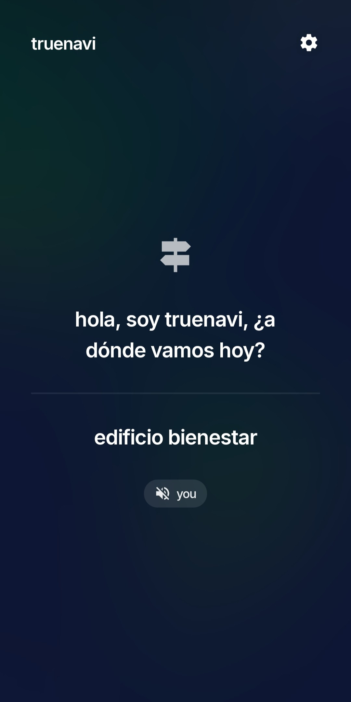
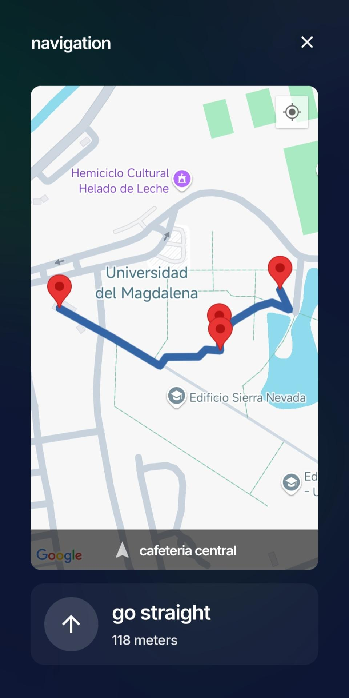

# Blind-First Navigation App

TrueNavi is a comprehensive navigation solution designed to assist visually impaired users. It consists of a voice-controlled React Native mobile application for navigation and a Next.js web dashboard for administrative management of the navigation graph and user accounts.

The mobile application provides a hands-free, conversational interface where users can set destinations and receive turn-by-turn audio instructions. The web dashboard features an interactive map editor, allowing administrators to define and manage the nodes and pathways that the navigation system relies on.

## Features

### Native Application (Voice-Controlled Navigation)

-   **Conversational Flow**: A state-driven conversational UI to guide users through setting up navigation.
-   **Voice Recognition**: Utilizes a hidden WebView with the `webkitSpeechRecognition` API for continuous and accurate voice command recognition.
-   **Speech Synthesis**: Delivers clear, audible turn-by-turn instructions and system feedback using `expo-speech`.
-   **Route Calculation**: Fetches optimized routes from the backend API, including total distance and path details.
-   **Map-Based Navigation**: Visualizes the user's route, current location, and navigation segments on a map using `react-native-maps`.
-   **Dynamic Weather Updates**: Optionally provides current weather conditions (temperature and chance of rain) at the start of a route.
-   **User Preferences**: Allows users to configure language (English/Spanish), weather updates, and haptic feedback.
-   **Permission Handling**: Gracefully requests and manages required permissions for location and microphone access.

### Web Application (Admin Dashboard)

-   **Secure Authentication**: JWT-based authentication for administrators with protected routes managed via Next.js middleware.
-   **Administrator Management**: A dashboard to create, view, search, edit, and delete administrator accounts.
-   **Interactive Map Editor**: A Leaflet-based map interface (`react-leaflet`) for visualizing and editing the navigation graph.
-   **Graph Management**:
    -   Create named or intermediate nodes directly on the map.
    -   Create edges (connections) between nodes by selecting them.
    -   Delete nodes and edges with confirmation.
-   **Contextual Tools**: A tool palette for switching between editing modes (add node, add connection, delete), with keyboard shortcuts for efficiency.
-   **UI Feedback**: Real-time status messages and modals to guide administrative actions.

## Technology Stack

The project is a monorepo containing two main packages:

-   **`native/`**: The React Native application built with Expo.
    -   **Framework**: Expo (SDK 52), React Native
    -   **Routing**: Expo Router
    -   **UI & Maps**: React Native Maps, React Native Vector Icons
    -   **Audio**: `expo-speech`, `@react-native-voice/voice`
    -   **Location**: `expo-location`
    -   **Language**: TypeScript
    -   **State Management**: Custom `useReducer` hook for flow control.

-   **`web/`**: The Next.js administrative dashboard.
    -   **Framework**: Next.js 15 (with Turbopack)
    -   **UI & Styling**: React 19, Tailwind CSS
    -   **Maps**: Leaflet, React-Leaflet
    -   **Language**: TypeScript
    -   **Authentication**: JWT stored in cookies

## Repository Structure

-   **`dejesusbg-truenavi/`**: The root of the monorepo.
    -   **`native/`**: Contains the source code for the Expo-based mobile application.
    -   **`web/`**: Contains the source code for the Next.js web application.

## Getting Started

### Prerequisites

-   Node.js (v18 or later)
-   npm or a compatible package manager
-   Expo Go app on your mobile device (for running the native app) or an Android/iOS emulator setup.

### Installation

1.  Clone the repository:
    ```sh
    git clone https://github.com/dejesusbg/truenavi.git
    ```

2.  Navigate to the project directory:
    ```sh
    cd truenavi
    ```

3.  Install dependencies for both the native and web projects. The root `package.json` contains a script to do this automatically.
    ```sh
    npm install
    ```
    This command will run `npm install` inside both the `native` and `web` directories.

## Running the Applications

### Web Application (Admin Dashboard)

To start the Next.js development server:

```sh
npm run web
```

The application will be available at `http://localhost:3000`.

### Native Application

To start the Expo development server for the mobile app:

```sh
npm run native
```

This will open the Expo developer tools in your browser. You can then:

-   Scan the QR code with the Expo Go app on your iOS or Android device.
-   Press `a` to run on an Android emulator.
-   Press `i` to run on an iOS simulator.

## Screenshots

<p>
  
  
</p>
